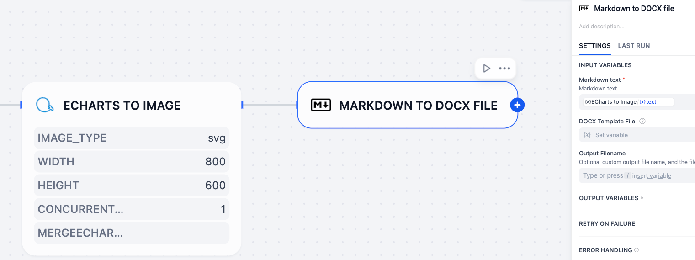

# ECharts 画像変換ツール

**作者:** hangboss1761
**バージョン:** 0.0.1
**種類:** tool
**リポジトリ:** <https://github.com/hangboss1761/echarts-convert-dify-plugin>

## 概要

ECharts 画像変換ツールは強力な Dify プラグインで、テキスト内の ECharts 設定を高品質の画像に変換します。このプラグインはバッチ処理、並列レンダリング、柔軟な出力形式設定をサポートしています。

**使用シナリオ**: markdown文字列内のEChartsチャート設定を画像に変換し、完全なmarkdown文字列をdocx/pdf形式に変換するのに最適です（`md_exporter`プラグインを使用）。



このプラグインは完全にオフラインで実行され、外部依存はゼロです。

> Echarts バージョン: 5.6.0

## 設定

ECharts 画像変換ツールは以下の設定オプションを提供します：

### 入力パラメータ

- **コンテンツ**: 1つ以上の ````echarts```` コードブロックを含むテキスト。コードブロックには ECharts JSON 設定が含まれます（必須）
- **画像タイプ**: 出力画像形式（`svg` - SVG のみ）
- **幅**: チャート幅（ピクセル、100-4000、デフォルト：800）
- **高さ**: チャート高さ（ピクセル、100-4000、デフォルト：600）

### 高度なオプション

- **Worker 数**: 並列レンダリングのワーカープロセス数（1-4、デフォルト：1）
  - **推奨**: 複雑なチャートは2-4、単純なチャートは1
- **ECharts 設定をマージ**: チャート設定とマージする追加の ECharts 設定（JSON 形式）（オプション）

### ⚡ 並列パフォーマンスガイド

**並列使用** (2-4ワーカー):
- 大量データセットを含む複雑なチャート
- マルチシリーズ可視化
- パフォーマンスはハードウェア能力に依存

**順次使用** (workerを使用しない):
- 単純なチャート（棒、円、折れ線チャート）
- 小データセット
- 単一チャートレンダリング

**注意**: パフォーマンス向上はデバイス仕様とチャート複雑度によります。

## 開発

### 開発環境設定

`.env.example` を `.env` にコピーして値を入力してください。

```bash
# Python 依存関係をインストール
pip install -r requirements.txt

# js-executor 依存関係をインストール（開発のみ）
cd js-executor
# Bun をインストール: <https://bun.sh/docs/installation>
# すでに Bun をインストールしている場合はスキップ
bun install

# 開発モードで実行
python -m main

# 開発モードでローカルバイナリを使用する場合、bun run build:dev を使用してローカルバイナリをビルドしてください。
ECHARTS_CONVERT_LOCAL_PATH=./executables/echarts-convert-local python -m main


# 詳細は GUIDE.md を参照
```

**注意:** Difyでの本番デプロイメントの場合、プラグインは**ゼロ外部依存**を必要とします。すべてのJavaScriptランタイム依存関係がプラグインにバンドルされており、外部API呼び出しやインターネット接続なしで完全なオフライン操作を可能にします。

その後、Dify ワークフローにプラグインを追加してテストします。

## 使用例

```markdown
# サンプルチャート

```echarts
{
  "title": {
    "text": "サンプルチャート"
  },
  "xAxis": {
    "type": "category",
    "data": ["月", "火", "水", "木", "金", "土", "日"]
  },
  "yAxis": {
    "type": "value"
  },
  "series": [{
    "data": [120, 200, 150, 80, 70, 110, 130],
    "type": "bar"
  }]
}
```
```

プラグインは自動的に ECharts 設定を抽出し、指定された画像形式に変換します。
